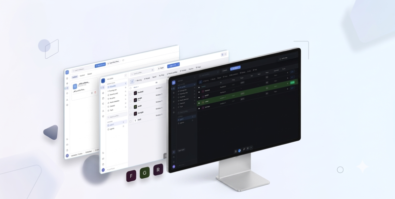

# Getting Started



## System Requirements

<div class="grid" style="display: grid; grid-template-columns: repeat(auto-fit, minmax(200px, 1fr)); gap: 1rem; margin: 1.5rem 0;">

<div style="border: 1px solid var(--vp-c-border); border-radius: 10px; padding: 1.25rem;">
<h4 style="margin: 0 0 0.5rem;">🐧 Linux</h4>
<p style="margin: 0; font-size: 0.875rem;">Ubuntu 20.04+, Fedora 38+, or equivalent<br><small>glibc 2.31+</small></p>
</div>

<div style="border: 1px solid var(--vp-c-border); border-radius: 10px; padding: 1.25rem;">
<h4 style="margin: 0 0 0.5rem;">🍎 macOS</h4>
<p style="margin: 0; font-size: 0.875rem;">macOS 12 Monterey or newer<br><small>Intel & Apple Silicon</small></p>
</div>

<div style="border: 1px solid var(--vp-c-border); border-radius: 10px; padding: 1.25rem;">
<h4 style="margin: 0 0 0.5rem;">🪟 Windows</h4>
<p style="margin: 0; font-size: 0.875rem;">Windows 10 1809+ or Windows 11<br><small>64-bit only</small></p>
</div>

</div>

All platforms require **4 GB RAM** and **500 MB free disk space**. The browser engine (~200 MB) is downloaded on first launch.

## Download

Download the latest release for your operating system from the [Releases page](https://github.com/arkdemiatop/ctrldlogin/releases).

| Platform | Formats | Size |
|----------|---------|------|
| Linux | `.AppImage`, `.deb`, `.rpm` | ~89 MB |
| macOS | `.dmg` (Intel & Apple Silicon) | ~89 MB |
| Windows | `.exe` (portable), `.msi` (installer) | ~89 MB |

> The browser engine (~200 MB) is downloaded automatically on first launch.

## Installation

### Linux

**AppImage:**
```bash
chmod +x ctrldlogin-*.AppImage
./ctrldlogin-*.AppImage
```

**Debian / Ubuntu (deb):**
```bash
sudo dpkg -i ctrldlogin-*.deb
```

**Fedora / RHEL (rpm):**
```bash
sudo rpm -ivh ctrldlogin-*.rpm
```

### macOS

The `.dmg` comes in two variants:
- **`_aarch64.dmg`** — for Apple Silicon (M1, M2, M3, M4)
- **`_amd64.dmg`** — for Intel-based Macs

1. Open the downloaded `.dmg` file
2. Drag the app into the **Applications** folder
3. If macOS blocks the app (unsigned), go to **System Settings → Privacy & Security** and click **Open Anyway** next to the ctrldlogin message — this is only needed once

### Windows

- **`.msi`** — Installs to Program Files, adds Start Menu entry
- **`.exe`** — Portable version, run from any folder

---

## First Launch

1. **Launch the application** — the browser engine will download automatically (~200 MB, one-time). This may take a few minutes depending on your connection speed.
2. **Create your first profile:**
   - Click **New Profile** in the top bar
   - Give it a name (the name determines its digital fingerprint)
   - Select a platform to spoof (Windows, macOS, or Linux)
   - Save the profile
3. **Launch the profile** — click the **Launch** button on the profile card
4. A browser window opens with your isolated fingerprint

### Optional: Configure a Proxy

1. Go to the **Proxies** section
2. Click **Add Proxy** and enter your proxy details (HTTP or SOCKS5)
3. Assign the proxy to your profile
4. Launch the profile — WebRTC IP will automatically match your proxy

---

## Verify Your Fingerprint

Launch a profile and visit [browserscan.net](https://browserscan.net) to verify your browser fingerprint is properly spoofed.

## Data Storage Locations

Your profiles, configurations, and browser data are stored in:

| Platform | Location |
|----------|----------|
| Linux | `~/.local/share/ctrldlogin/` |
| macOS | `~/Library/Application Support/ctrldlogin/` |
| Windows | `%APPDATA%/ctrldlogin/` |

You can back up or migrate profiles by copying the entire directory.

## Next Steps

- Explore [all features](/features)
- Read the [API reference](/api-guide) for programmatic control
- Check the [FAQ](/faq) for common questions
- Review the [privacy policy](/privacy)
